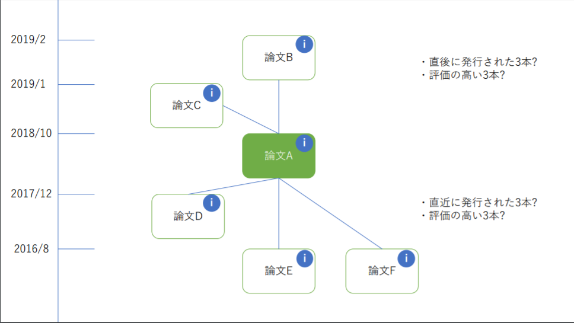

# PaperTracker

論文の被引用・引用を可視化するという特徴を持ったwebアプリケーションを目指しています。
<!-- "hoge"が何かを簡潔に紹介する -->

# DEMO


<!-- "hoge"の魅力が直感的に伝えわるデモ動画や図解を載せる -->

<!-- # Features -->

<!-- "hoge"のセールスポイントや差別化などを説明する -->

<!-- # Requirement -->

<!-- "hoge"を動かすのに必要なライブラリなどを列挙する -->

<!-- 
* huga 3.5.2
* hogehuga 1.0.2
-->

<!-- # Installation -->

<!--
Requirementで列挙したライブラリなどのインストール方法を説明する

```bash
pip install huga_package
``` 
-->

# Usage


DEMOの実行方法など、"hoge"の基本的な使い方を説明する

```bash
git clone https://github.com/PastaSoba/PaperTracker_enpit
cd frontend
yarn start
```


<!-- # Note -->

<!-- 注意点などがあれば書く -->

# Author

* 作成者: enpit準拠テーマ Javascriptによる可視化 チーム4